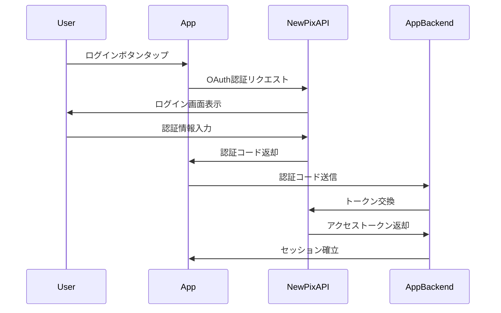

# MyFurdi アプリ - 運用プラン

**作成日**: 2025年10月9日
**バージョン**: 1.0.0
**目的**: フェーズ別の運用体制とシステム基盤の整備計画

---

## 📋 目次

1. [フェーズ1：運用基盤構築](#フェーズ1運用基盤構築)
2. [フェーズ2：運用拡張](#フェーズ2運用拡張)
3. [技術スタック](#技術スタック)
4. [セキュリティ対策](#セキュリティ対策)
5. [監視・運用体制](#監視運用体制)

---

## フェーズ1：運用基盤構築

### 1. リリース体制

#### ストア公開プロセス

**App Store（iOS）**
- [ ] Apple Developer Program登録
- [ ] App IDの作成
- [ ] プロビジョニングプロファイル作成
- [ ] App Store Connect設定
- [ ] スクリーンショット・プロモーション素材準備
- [ ] プライバシーポリシー・利用規約準備
- [ ] 審査申請・対応フロー確立

**Google Play（Android）**
- [ ] Google Play Console登録
- [ ] アプリ署名鍵の生成・管理
- [ ] ストアリスティング準備
- [ ] スクリーンショット・プロモーション素材準備
- [ ] プライバシーポリシー・利用規約準備
- [ ] 審査申請・対応フロー確立

#### ベータテストプログラム

**社内テスト（Week 1-2）**
- TestFlight（iOS）/ Internal Testing（Android）
- 対象: 開発チーム、社内スタッフ
- 目的: 基本機能の動作確認、クラッシュ検出

**限定ユーザーテスト（Week 3-4）**
- TestFlight（iOS）/ Closed Testing（Android）
- 対象: 協力会員50〜100名
- 目的: 実運用環境でのテスト、フィードバック収集

**オープンベータ（Week 5-6）**
- TestFlight（iOS）/ Open Testing（Android）
- 対象: 一般会員（希望者）
- 目的: 大規模負荷テスト、最終調整

#### 品質管理

**クラッシュレポート収集**
- Firebase Crashlytics
- Sentry（オプション）
- 目標: クラッシュ率 < 1%

**バグトラッキング**
- GitHub Issues
- Jira（オプション）
- バグ優先度: Critical / High / Medium / Low

**パフォーマンス監視**
- Firebase Performance Monitoring
- 目標:
  - アプリ起動時間 < 2秒
  - 画面遷移時間 < 300ms
  - API応答時間 < 500ms

---

### 2. ポイント基盤

#### サーバー側実装

**データベース設計**
```sql
-- ユーザーポイントテーブル
CREATE TABLE user_points (
  user_id VARCHAR(255) PRIMARY KEY,
  total_points INT DEFAULT 0,
  available_points INT DEFAULT 0,
  pending_points INT DEFAULT 0,
  created_at TIMESTAMP DEFAULT CURRENT_TIMESTAMP,
  updated_at TIMESTAMP DEFAULT CURRENT_TIMESTAMP ON UPDATE CURRENT_TIMESTAMP
);

-- ポイント履歴テーブル
CREATE TABLE point_history (
  id BIGINT PRIMARY KEY AUTO_INCREMENT,
  user_id VARCHAR(255),
  action_type VARCHAR(50), -- 'earn', 'redeem', 'expire', 'adjust'
  points INT,
  description TEXT,
  related_id VARCHAR(255), -- 関連する活動ID（来館ID、チャレンジIDなど）
  created_at TIMESTAMP DEFAULT CURRENT_TIMESTAMP,
  INDEX idx_user_id (user_id),
  INDEX idx_created_at (created_at)
);

-- ポイントルールテーブル
CREATE TABLE point_rules (
  id INT PRIMARY KEY AUTO_INCREMENT,
  rule_name VARCHAR(100),
  action_type VARCHAR(50), -- 'visit', 'workout', 'challenge', etc.
  points INT,
  is_active BOOLEAN DEFAULT TRUE,
  start_date DATE,
  end_date DATE,
  created_at TIMESTAMP DEFAULT CURRENT_TIMESTAMP
);
```

#### API設計

**ポイント取得API**
```
GET /api/v1/users/{userId}/points
Response:
{
  "userId": "string",
  "totalPoints": 1000,
  "availablePoints": 800,
  "pendingPoints": 200
}
```

**ポイント履歴API**
```
GET /api/v1/users/{userId}/points/history
Query: limit, offset, startDate, endDate
Response:
{
  "history": [
    {
      "date": "2025-03-01T10:00:00Z",
      "action": "visit",
      "points": 10,
      "description": "来館ポイント"
    }
  ],
  "total": 100
}
```

**ポイント付与API（内部用）**
```
POST /api/v1/internal/points/grant
Body:
{
  "userId": "string",
  "actionType": "string",
  "points": 10,
  "description": "string",
  "relatedId": "string"
}
```

#### 付与方式の実装

**案1: 逐次付与方式**
```javascript
// リアルタイム付与処理
async function grantPointsImmediately(userId, actionType, points) {
  const rule = await getActiveRule(actionType);
  if (!rule) return;

  await db.transaction(async (trx) => {
    // ポイント加算
    await trx('user_points')
      .where('user_id', userId)
      .increment('total_points', points)
      .increment('available_points', points);

    // 履歴記録
    await trx('point_history').insert({
      user_id: userId,
      action_type: actionType,
      points: points,
      description: rule.description
    });
  });

  // プッシュ通知送信（オプション）
  await sendNotification(userId, `${points}ポイント獲得！`);
}
```

**案2: バッチ一括計算方式**
```javascript
// 日次バッチ処理
async function calculatePointsDaily() {
  const yesterday = new Date();
  yesterday.setDate(yesterday.getDate() - 1);

  // 昨日の活動データを集計
  const activities = await db('user_activities')
    .where('date', yesterday.toISOString().split('T')[0])
    .select('user_id', 'action_type', db.raw('COUNT(*) as count'));

  for (const activity of activities) {
    const rule = await getActiveRule(activity.action_type);
    if (!rule) continue;

    const points = rule.points * activity.count;
    await grantPointsImmediately(activity.user_id, activity.action_type, points);
  }
}

// Cron設定: 毎日午前2時実行
// 0 2 * * * node scripts/calculate-points-daily.js
```

---

### 3. バッジ基盤

#### サーバー側実装

**データベース設計**
```sql
-- バッジ定義テーブル
CREATE TABLE badge_definitions (
  badge_id VARCHAR(50) PRIMARY KEY,
  name VARCHAR(100),
  description TEXT,
  image_url VARCHAR(255),
  category VARCHAR(50), -- 'visit', 'workout', 'body_composition', 'special'
  rarity VARCHAR(20), -- 'common', 'rare', 'epic', 'legendary'
  condition_type VARCHAR(50), -- 'visit_count', 'workout_count', 'streak', etc.
  condition_value INT,
  is_active BOOLEAN DEFAULT TRUE,
  display_order INT,
  created_at TIMESTAMP DEFAULT CURRENT_TIMESTAMP,
  updated_at TIMESTAMP DEFAULT CURRENT_TIMESTAMP ON UPDATE CURRENT_TIMESTAMP
);

-- ユーザーバッジテーブル
CREATE TABLE user_badges (
  id BIGINT PRIMARY KEY AUTO_INCREMENT,
  user_id VARCHAR(255),
  badge_id VARCHAR(50),
  earned_at TIMESTAMP DEFAULT CURRENT_TIMESTAMP,
  is_new BOOLEAN DEFAULT TRUE,
  UNIQUE KEY unique_user_badge (user_id, badge_id),
  INDEX idx_user_id (user_id)
);
```

#### API設計

**バッジ定義取得API**
```
GET /api/v1/badges
Query: category, rarity
Response:
{
  "badges": [
    {
      "badgeId": "visit_10",
      "name": "10回来館",
      "description": "FURDIに10回来館しました",
      "imageUrl": "https://cdn.example.com/badges/visit_10.png",
      "category": "visit",
      "rarity": "common",
      "conditionType": "visit_count",
      "conditionValue": 10
    }
  ]
}
```

**ユーザーバッジ取得API**
```
GET /api/v1/users/{userId}/badges
Response:
{
  "earnedBadges": [
    {
      "badgeId": "visit_10",
      "earnedAt": "2025-03-01T10:00:00Z",
      "isNew": false
    }
  ],
  "totalCount": 15,
  "newCount": 2
}
```

**バッジ獲得チェックAPI（内部用）**
```
POST /api/v1/internal/badges/check
Body:
{
  "userId": "string",
  "actionType": "string"
}
Response:
{
  "newBadges": [
    {
      "badgeId": "visit_10",
      "name": "10回来館"
    }
  ]
}
```

#### バッジ管理画面（Web管理側）

**機能**
- [ ] バッジ定義の追加・編集・削除
- [ ] バッジ画像のアップロード・差し替え
- [ ] バッジカテゴリの管理
- [ ] バッジ獲得条件の設定
- [ ] バッジ表示順の変更
- [ ] バッジのアクティブ/非アクティブ切り替え

**画像管理**
- CDN使用（CloudFront / Cloud CDN）
- 画像フォーマット: PNG（透過対応）、SVG
- サイズ: 128×128px（@2x: 256×256px）
- 命名規則: `{category}_{achievement}.png`

---

### 4. 連携基盤

#### 新Pix連携

**認証フロー**


**データ同期API**
```
GET /api/v1/integrations/new-pix/workouts
Headers: Authorization: Bearer {token}
Response:
{
  "workouts": [
    {
      "workoutId": "string",
      "date": "2025-03-01",
      "duration": 30,
      "calories": 200,
      "exercises": [...]
    }
  ]
}
```

#### Q.Pix連携

**店舗ごとの対応管理**
```sql
-- 店舗マスタテーブル
CREATE TABLE stores (
  store_id VARCHAR(50) PRIMARY KEY,
  store_name VARCHAR(100),
  has_qpix BOOLEAN DEFAULT FALSE,
  qpix_api_url VARCHAR(255),
  created_at TIMESTAMP DEFAULT CURRENT_TIMESTAMP
);

-- ユーザー店舗紐付けテーブル
CREATE TABLE user_stores (
  user_id VARCHAR(255),
  store_id VARCHAR(50),
  is_primary BOOLEAN DEFAULT FALSE,
  PRIMARY KEY (user_id, store_id)
);
```

**権限チェック**
```javascript
async function canSyncQPix(userId) {
  const userStore = await db('user_stores')
    .join('stores', 'user_stores.store_id', 'stores.store_id')
    .where('user_stores.user_id', userId)
    .where('user_stores.is_primary', true)
    .first();

  return userStore && userStore.has_qpix;
}
```

#### タニタ連携

**OAuth実装**
```javascript
// タニタOAuth設定
const TANITA_OAUTH_CONFIG = {
  clientId: process.env.TANITA_CLIENT_ID,
  clientSecret: process.env.TANITA_CLIENT_SECRET,
  redirectUri: 'myfurdi://oauth/tanita/callback',
  authUrl: 'https://www.healthplanet.jp/oauth/auth',
  tokenUrl: 'https://www.healthplanet.jp/oauth/token'
};

// データ取得
async function getTanitaData(userId) {
  const token = await getStoredToken(userId, 'tanita');
  if (!token) return null;

  const response = await fetch('https://www.healthplanet.jp/status/innerscan.json', {
    headers: {
      'Authorization': `Bearer ${token.access_token}`
    }
  });

  return response.json();
}
```

---

### 5. 認証・権限管理

#### 認証基盤

**JWT実装**
```javascript
const jwt = require('jsonwebtoken');

// トークン生成
function generateToken(userId, expiresIn = '7d') {
  return jwt.sign(
    { userId, iat: Math.floor(Date.now() / 1000) },
    process.env.JWT_SECRET,
    { expiresIn }
  );
}

// リフレッシュトークン生成
function generateRefreshToken(userId) {
  return jwt.sign(
    { userId, type: 'refresh' },
    process.env.JWT_REFRESH_SECRET,
    { expiresIn: '30d' }
  );
}

// トークン検証ミドルウェア
function authenticateToken(req, res, next) {
  const authHeader = req.headers['authorization'];
  const token = authHeader && authHeader.split(' ')[1];

  if (!token) return res.sendStatus(401);

  jwt.verify(token, process.env.JWT_SECRET, (err, user) => {
    if (err) return res.sendStatus(403);
    req.user = user;
    next();
  });
}
```

#### SSO実装

**Apple Sign In（iOS）**
```swift
// iOS側実装
import AuthenticationServices

func handleAppleSignIn() {
  let request = ASAuthorizationAppleIDProvider().createRequest()
  request.requestedScopes = [.fullName, .email]

  let controller = ASAuthorizationController(authorizationRequests: [request])
  controller.delegate = self
  controller.presentationContextProvider = self
  controller.performRequests()
}

func authorizationController(controller: ASAuthorizationController,
                            didCompleteWithAuthorization authorization: ASAuthorization) {
  if let appleIDCredential = authorization.credential as? ASAuthorizationAppleIDCredential {
    let userIdentifier = appleIDCredential.user
    let identityToken = appleIDCredential.identityToken

    // バックエンドに送信してセッション確立
    sendToBackend(userIdentifier, identityToken)
  }
}
```

**Google SSO**
```javascript
// バックエンド側検証
const { OAuth2Client } = require('google-auth-library');
const client = new OAuth2Client(process.env.GOOGLE_CLIENT_ID);

async function verifyGoogleToken(token) {
  const ticket = await client.verifyIdToken({
    idToken: token,
    audience: process.env.GOOGLE_CLIENT_ID
  });

  const payload = ticket.getPayload();
  return {
    userId: payload['sub'],
    email: payload['email'],
    name: payload['name']
  };
}
```

#### 機種変・データ引き継ぎ

**アカウントバックアップ**
```sql
-- バックアップテーブル
CREATE TABLE user_backups (
  user_id VARCHAR(255) PRIMARY KEY,
  backup_data JSON, -- ポイント、バッジ、設定など
  last_backup_at TIMESTAMP DEFAULT CURRENT_TIMESTAMP,
  device_id VARCHAR(255),
  platform VARCHAR(20) -- 'ios', 'android'
);
```

**復元API**
```
POST /api/v1/users/{userId}/restore
Body:
{
  "deviceId": "string",
  "platform": "ios"
}
Response:
{
  "points": {...},
  "badges": [...],
  "settings": {...}
}
```

---

### 6. 管理・分析

#### Firebase Analytics設定

**カスタムイベント定義**
```javascript
// イベント送信例
logEvent('screen_view', {
  screen_name: 'HomeScreen',
  screen_class: 'HomeScreen'
});

logEvent('badge_earned', {
  badge_id: 'visit_10',
  badge_category: 'visit',
  badge_rarity: 'common'
});

logEvent('point_earned', {
  action_type: 'visit',
  points: 10
});

logEvent('integration_connected', {
  service: 'tanita'
});
```

**ユーザープロパティ設定**
```javascript
setUserProperties({
  user_tier: 'gold',
  primary_store: 'store_001',
  total_visits: 50
});
```

#### 管理ダッシュボード

**必要な指標**
- KPI（重要業績評価指標）
  - DAU / MAU
  - 継続率（D1 / D7 / D30）
  - LTV（顧客生涯価値）

- 機能別利用率
  - 画面別アクセス数
  - バッジ獲得率
  - 連携サービス利用率

- セグメント分析
  - 店舗別アクティブ率
  - 会員種別別利用状況
  - デバイスOS別分布

**ダッシュボード実装**
- Google Data Studio / Looker Studio
- または、カスタムダッシュボード（React + Chart.js）

---

### 7. サーバー側管理基盤

#### コンテンツ管理システム（CMS）

**お知らせ管理**
```sql
CREATE TABLE announcements (
  id INT PRIMARY KEY AUTO_INCREMENT,
  title VARCHAR(255),
  content TEXT,
  image_url VARCHAR(255),
  category VARCHAR(50), -- 'news', 'maintenance', 'event'
  priority INT, -- 1: 高, 2: 中, 3: 低
  start_date DATETIME,
  end_date DATETIME,
  target_segment VARCHAR(50), -- 'all', 'ios', 'android', 'store_xxx'
  is_push_notification BOOLEAN DEFAULT FALSE,
  created_at TIMESTAMP DEFAULT CURRENT_TIMESTAMP
);
```

**イベント管理**
```sql
CREATE TABLE events (
  event_id VARCHAR(50) PRIMARY KEY,
  event_name VARCHAR(100),
  description TEXT,
  banner_image_url VARCHAR(255),
  start_date DATETIME,
  end_date DATETIME,
  event_type VARCHAR(50), -- 'challenge', 'campaign', 'special'
  config JSON, -- イベント固有の設定
  is_active BOOLEAN DEFAULT TRUE,
  created_at TIMESTAMP DEFAULT CURRENT_TIMESTAMP
);
```

#### プッシュ通知

**Firebase Cloud Messaging（FCM）設定**
```javascript
const admin = require('firebase-admin');

// 通知送信
async function sendPushNotification(userId, title, body, data = {}) {
  const tokens = await getUserDeviceTokens(userId);

  const message = {
    notification: {
      title: title,
      body: body
    },
    data: data,
    tokens: tokens
  };

  const response = await admin.messaging().sendMulticast(message);
  console.log(`${response.successCount} notifications sent successfully`);
}

// セグメント配信
async function sendSegmentedNotification(segment, title, body) {
  const condition = buildCondition(segment); // 'store_001' in topics

  const message = {
    notification: { title, body },
    condition: condition
  };

  await admin.messaging().send(message);
}
```

---

## フェーズ2：運用拡張

### 1. GameFi運用

#### ミッション管理

**データベース設計**
```sql
CREATE TABLE missions (
  mission_id VARCHAR(50) PRIMARY KEY,
  mission_name VARCHAR(100),
  description TEXT,
  mission_type VARCHAR(20), -- 'daily', 'weekly', 'monthly', 'season'
  condition_type VARCHAR(50),
  condition_value INT,
  reward_points INT,
  start_date DATETIME,
  end_date DATETIME,
  is_active BOOLEAN DEFAULT TRUE
);

CREATE TABLE user_missions (
  user_id VARCHAR(255),
  mission_id VARCHAR(50),
  progress INT DEFAULT 0,
  is_completed BOOLEAN DEFAULT FALSE,
  completed_at TIMESTAMP NULL,
  PRIMARY KEY (user_id, mission_id)
);
```

#### ガチャ管理

**確率設定**
```sql
CREATE TABLE gacha_pools (
  pool_id VARCHAR(50) PRIMARY KEY,
  pool_name VARCHAR(100),
  start_date DATETIME,
  end_date DATETIME,
  cost_points INT,
  is_active BOOLEAN DEFAULT TRUE
);

CREATE TABLE gacha_items (
  item_id VARCHAR(50) PRIMARY KEY,
  pool_id VARCHAR(50),
  item_name VARCHAR(100),
  item_type VARCHAR(50), -- 'badge', 'wallpaper', 'points'
  rarity VARCHAR(20),
  probability DECIMAL(5, 4), -- 0.0001 〜 1.0000
  value INT
);

-- 確率の合計が1.0になることを保証
```

**ガチャ実行ロジック**
```javascript
async function executeGacha(userId, poolId) {
  // ポイントチェック
  const user = await getUser(userId);
  const pool = await getGachaPool(poolId);

  if (user.availablePoints < pool.costPoints) {
    throw new Error('Insufficient points');
  }

  // アイテム抽選
  const items = await getGachaItems(poolId);
  const result = weightedRandom(items);

  // ポイント減算
  await deductPoints(userId, pool.costPoints);

  // アイテム付与
  await grantItem(userId, result);

  // 履歴記録
  await logGachaHistory(userId, poolId, result);

  return result;
}

function weightedRandom(items) {
  const random = Math.random();
  let cumulativeProbability = 0;

  for (const item of items) {
    cumulativeProbability += item.probability;
    if (random <= cumulativeProbability) {
      return item;
    }
  }

  return items[items.length - 1]; // フォールバック
}
```

---

### 2. ランク・リーダーボード

#### ランク判定バッチ

**日次バッチ処理**
```javascript
async function updateUserRanks() {
  const users = await db('user_points').select('user_id', 'total_points');

  for (const user of users) {
    const newRank = determineRank(user.total_points);
    const currentRank = await getCurrentRank(user.user_id);

    if (newRank !== currentRank) {
      await updateRank(user.user_id, newRank);

      // ランクアップ通知
      if (isRankUp(currentRank, newRank)) {
        await sendPushNotification(
          user.user_id,
          'ランクアップ！',
          `${newRank}ランクに昇格しました！`
        );
      }
    }
  }
}

function determineRank(points) {
  if (points >= 10000) return 'Platinum';
  if (points >= 5000) return 'Gold';
  if (points >= 1000) return 'Silver';
  return 'Bronze';
}
```

#### リーダーボード集計

**週次集計処理**
```sql
-- 週次ランキングテーブル
CREATE TABLE weekly_leaderboard (
  week_start_date DATE,
  user_id VARCHAR(255),
  points_earned INT,
  rank INT,
  PRIMARY KEY (week_start_date, user_id),
  INDEX idx_rank (week_start_date, rank)
);

-- 集計処理（毎週月曜日午前2時実行）
INSERT INTO weekly_leaderboard (week_start_date, user_id, points_earned, rank)
SELECT
  DATE_SUB(CURDATE(), INTERVAL WEEKDAY(CURDATE()) DAY) as week_start_date,
  user_id,
  SUM(points) as points_earned,
  RANK() OVER (ORDER BY SUM(points) DESC) as rank
FROM point_history
WHERE created_at >= DATE_SUB(CURDATE(), INTERVAL 7 DAY)
GROUP BY user_id;
```

---

### 3. スマートウォッチ連携

#### Apple Health連携

**データ同期処理**
```swift
// iOS HealthKit統合
import HealthKit

func syncHealthData() {
  let healthStore = HKHealthStore()

  let stepType = HKQuantityType.quantityType(forIdentifier: .stepCount)!
  let query = HKStatisticsQuery(quantityType: stepType,
                                quantitySamplePredicate: nil,
                                options: .cumulativeSum) { _, result, error in
    guard let result = result, let sum = result.sumQuantity() else { return }
    let steps = sum.doubleValue(for: HKUnit.count())

    // バックエンドに送信
    self.sendToBackend(steps: Int(steps))
  }

  healthStore.execute(query)
}
```

---

### 4. DNA検査QA機能

#### バックエンドAPI統合

**PHP APIとの連携**
```javascript
// Node.js → PHP API
async function queryDNAInsights(userId, question) {
  const dnaData = await getDNAResults(userId);

  const response = await fetch(process.env.DNA_QA_API_URL, {
    method: 'POST',
    headers: {
      'Content-Type': 'application/json',
      'Authorization': `Bearer ${process.env.DNA_API_KEY}`
    },
    body: JSON.stringify({
      userId: userId,
      dnaData: dnaData,
      question: question
    })
  });

  return response.json();
}
```

#### セキュリティ対策

**監査ログ**
```sql
CREATE TABLE dna_access_logs (
  id BIGINT PRIMARY KEY AUTO_INCREMENT,
  user_id VARCHAR(255),
  accessed_at TIMESTAMP DEFAULT CURRENT_TIMESTAMP,
  access_type VARCHAR(50), -- 'view', 'qa_query'
  ip_address VARCHAR(45),
  user_agent TEXT,
  request_data JSON
);
```

---

## 技術スタック

### バックエンド
- **言語**: Node.js (Express) / PHP（既存システム連携）
- **データベース**: MySQL 8.0 / PostgreSQL
- **キャッシュ**: Redis
- **ストレージ**: AWS S3 / Google Cloud Storage
- **CDN**: CloudFront / Cloud CDN

### インフラ
- **クラウド**: AWS / Google Cloud Platform
- **コンテナ**: Docker / Kubernetes（オプション）
- **CI/CD**: GitHub Actions / GitLab CI

### 監視・運用
- **APM**: New Relic / Datadog
- **ログ**: CloudWatch / Stackdriver
- **エラー追跡**: Sentry
- **アナリティクス**: Firebase Analytics / Google Analytics 4

---

## セキュリティ対策

### 1. データ保護
- [ ] データベース暗号化（at rest）
- [ ] 通信暗号化（TLS 1.3）
- [ ] 個人情報のマスキング
- [ ] 定期的なバックアップ

### 2. 認証・認可
- [ ] JWT トークン管理
- [ ] リフレッシュトークンローテーション
- [ ] セッションタイムアウト設定
- [ ] ブルートフォース対策

### 3. API セキュリティ
- [ ] レート制限（Rate Limiting）
- [ ] CORS 設定
- [ ] APIキー管理
- [ ] 入力検証・サニタイゼーション

### 4. 監査・コンプライアンス
- [ ] アクセスログ記録
- [ ] 個人情報アクセス監査
- [ ] GDPR / 個人情報保護法対応
- [ ] セキュリティ監査（年次）

---

## 監視・運用体制

### 1. 監視項目

**システム監視**
- サーバーCPU / メモリ使用率
- データベース接続数・クエリ性能
- API応答時間
- エラー率

**アプリ監視**
- クラッシュ率
- ANR（Application Not Responding）率
- ネットワークエラー率
- バッテリー消費量

### 2. アラート設定

**Critical（即時対応）**
- サービスダウン
- クラッシュ率 > 5%
- API応答時間 > 5秒

**High（1時間以内）**
- エラー率 > 3%
- データベース接続エラー

**Medium（当日中）**
- API応答時間 > 1秒
- クラッシュ率 > 2%

### 3. オンコール体制
- 平日: 9:00〜18:00（通常サポート）
- 休日・夜間: オンコール対応（Critical のみ）

---

## リリーススケジュール

### Phase1（3月上旬リリース）

| Week | タスク | 担当 | 状態 |
|------|--------|------|------|
| 1-2 | バックエンド基盤構築 | サーバーチーム | 予定 |
| 3-4 | API実装・テスト | サーバーチーム | 予定 |
| 5-6 | 社内ベータテスト | 全体 | 予定 |
| 7-8 | 限定ユーザーテスト | 全体 | 予定 |
| 9-10 | 最終調整・審査申請 | 全体 | 予定 |
| 11 | ストア公開 | リリースチーム | 予定 |

---

**更新履歴**

| 日付 | バージョン | 更新内容 |
|-----|----------|---------|
| 2025-10-09 | 1.0.0 | 初版作成（議事録からの整理） |
